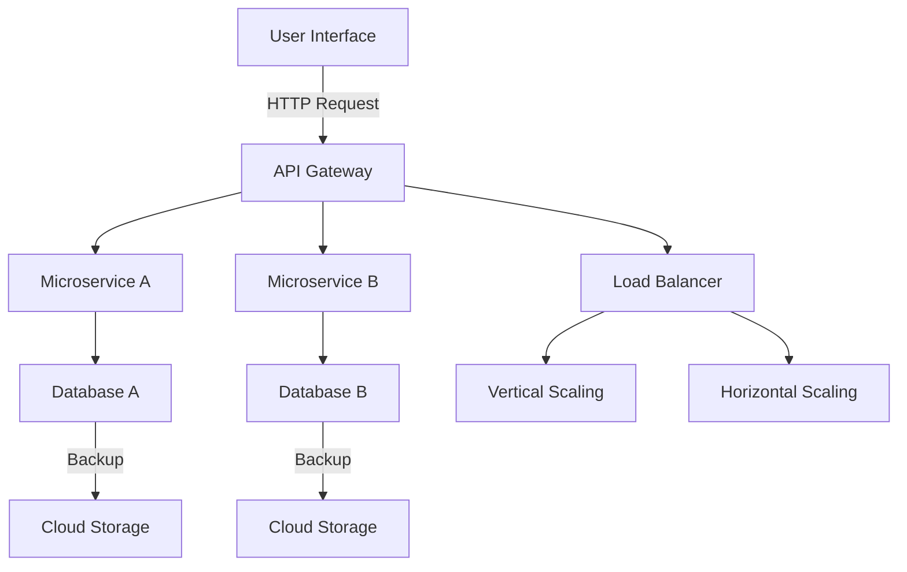

# Architecture Overview

## Advanced Mermaid Diagram

## Detailed Component Descriptions

### User Interface
The front-end is designed using React and enhances user experience through responsive design and a fluid interface. It communicates with the backend via REST APIs.

### API Gateway
The API Gateway serves as the entry point for all client requests. It handles request routing, composition, and protocol translation.

### Microservices
- **Microservice A**: Responsible for handling user authentication and authorization.
- **Microservice B**: Manages data processing and business logic.

### Databases
- **Database A**: Utilized by Microservice A for user management and credentials.
- **Database B**: Used by Microservice B for operational data storage.

## Deployment Considerations
When deploying the application:
- Use *containerization* with Docker for consistent environments.
- Deploy using *Kubernetes* for orchestration to manage scaling and availability.

## Scalability Notes
- The architecture supports both vertical scaling by adding more resources to existing instances and horizontal scaling by adding more instances.
- Implementing a microservices architecture allows for independent scaling of services based on demand.

## Best Practices
- Ensure thorough logging for monitoring service health and user activity.
- Implement circuit breakers to handle service failures gracefully.
- Regularly update dependencies and review security practices.

---

This document serves as a comprehensive overview of the architecture and operational considerations for a scalable production-ready application.