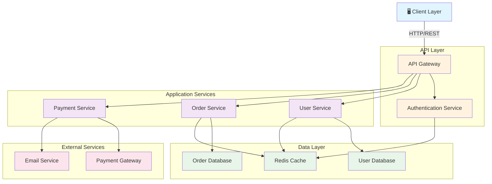

# System Architecture Overview

## Architecture Components

### Client Layer
- Web browsers and mobile applications that interact with the system

### API Layer
- **API Gateway**: Single entry point for all client requests, handles routing and load balancing
- **Authentication Service**: Manages user authentication and authorization

### Application Services
- **User Service**: Handles user profile management and operations
- **Order Service**: Manages order creation, processing, and tracking
- **Payment Service**: Handles payment processing and transactions

### Data Layer
- **User Database**: Stores user account information
- **Order Database**: Stores order and transaction data
- **Redis Cache**: Provides caching for frequently accessed data

### External Services
- **Payment Gateway**: Third-party payment processing service
- **Email Service**: Handles transactional email notifications

## Data Flow
1. Client sends requests to the API Gateway
2. Gateway routes requests to appropriate services
3. Services authenticate via the Authentication Service
4. Services interact with databases and cache
5. External services are called as needed for payments and notifications